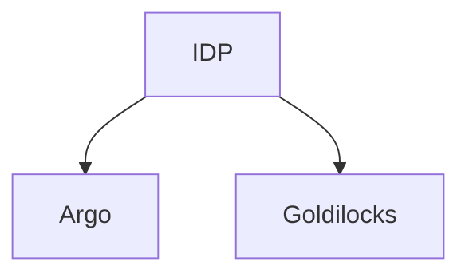

# argodemo

* Install argo:

```bash
kubectl create namespace argocd
kubectl apply -n argocd -f https://raw.githubusercontent.com/argoproj/argo-cd/stable/manifests/install.yaml

# port forward
kubectl port-forward svc/argocd-server -n argocd 8080:443

# get secret
kubectl -n argocd get secret argocd-initial-admin-secret -o jsonpath="{.data.password}" | base64 -d
```

* CLI:

```bash
brew install argocd
argocd login 127.0.0.1:8080

# just create a service NOT MANAGED BY ARGO
kubectl expose deploy webapp --name=webapp-svc --type=LoadBalancer --port=8888 --target-port=8888

# sync and get status for app helloapp
argocd app sync helloapp
argocd app get helloapp
```


# cautious-idp
PE for demo



